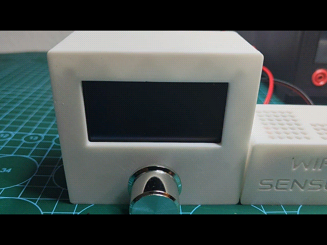

# Smart Thermostat (ESP32)

## Overview
This project is an ESP32-based Smart Thermostat designed for flexible home automation.
It can dynamically detect up to 10 sensors on the same network and automatically map them.
The thermostat offers advanced control and monitoring features while being fully compatible with the Blynk app.

## Features
- Dynamic sensor detection (up to 10 sensors)
- Night and day temperature profiles
- Programmable schedule for heating control
- List connected sensors and monitor their data
- Optional outdoor temperature monitoring
- Average temperature calculation or single-sensor mode
- Blynk app integration for remote monitoring and control
- Barometric weather forecasting
- Daytime temperature adjustment

## Hardware Requirements
- ESP32 board
- Temperature/Humidity/Pressure sensors (up to 10)
- OLED Display
- Relay module or solid-state relay for heating control
- Power supply (e.g., 220V AC for mains input, regulated 5V for ESP32)
- Encoder
  
### Required Sensor Modules
- ESP01 (2866) module (one per sensor)
- BME280 sensor

## Pin Assignment for Main Unit (ESP32 Thermostat) - Example

| Function                   | Pin |
|----------------------------|-----|
| Relay Control              | D14 |
| Encoder DT                 | D18 |
| Encoder CLK                | D5  |
| Encoder Button             | D19 |
| OLED SDA                   | D21 |
| OLED SCL                   | D22 |

## Pin Assignment for Sensor Modules (ESP01 + BME280) - Example

| Function                   | Pin |
|----------------------------|-----|
| BME280 SDA                 | D0  |
| BME280 SCL                 | D2  |

## Usage
- On startup, the device scans the network for sensors and maps them automatically
- Configure schedules and desired temperatures using the device interface or Blynk app
- Monitor sensor data and heating status remotely via the app
- Adjust daytime/nighttime temperature profiles as needed

## Notes
- The maximum number of sensors may vary depending on network conditions and signal strength
- Ensure all mains wiring is handled safely and complies with local regulations

## Demo

### Boot Sequence

### Features

## License
This project is licensed under the MIT License. See the LICENSE file for details.
